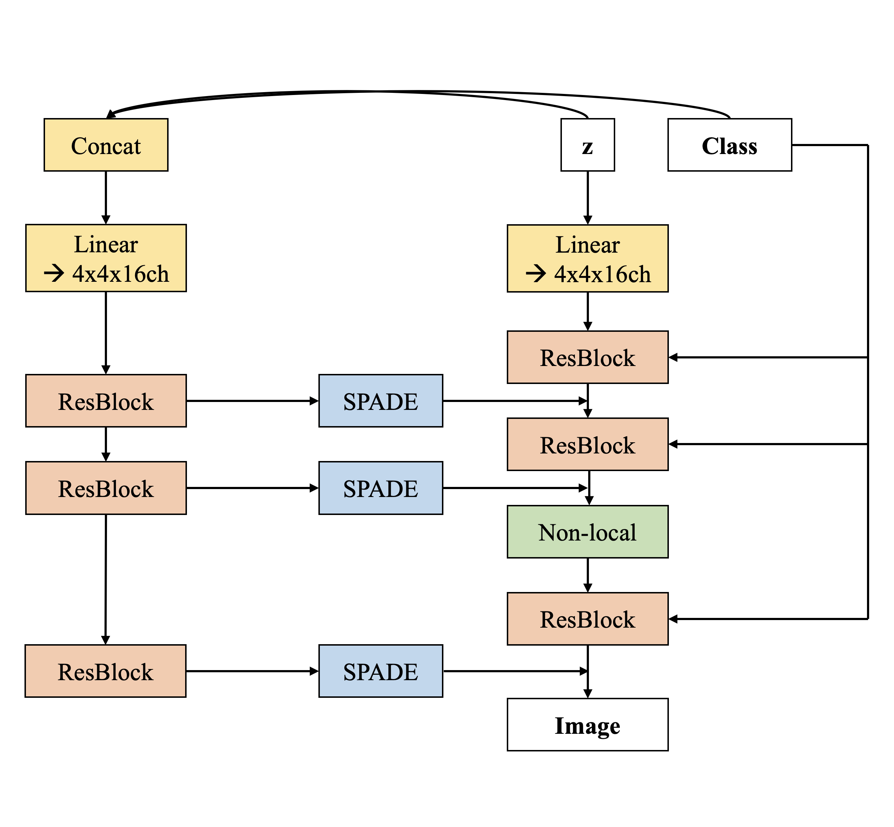

# Spatial Self-modulation on BigGAN

This repository contains project code of spatial-self-modulation-on-biggan.

**Contribution** of this proejct is
* Improve BigGAN's generation quality on ImageNet by adding spatial self-modulation.

#### Below is the architecture diagram.


## Requirements

This repository starts from <a href="https://github.com/uoguelph-mlrg/instance_selection_for_gans">Instance Selection for GANs Official PyTorch Code</a>, and requirements are exactly same.

## Preparing ImageNet-64x64

To train a BigGAN on ImageNet you will first need to construct an HDF5 dataset file for ImageNet (optional), compute Inception moments for calculating FID, and construct the image manifold for calculating Precision, Recall, Density, and Coverage. All can by done by modifying and running 
```
bash scripts/utils/prepare_data_imagenet_[res].sh
```
where [res] is substituted with the desired resolution (options are 64, 128, or 256). These scripts will assume that ImageNet is in a folder called `data` in the instance_selection_for_gans directory. Replace this with the filepath to your copy of ImageNet. 

## Training on ImageNet-64x64

```.bash
bash scripts/launch_SAGAN_res64_ch32_bs128_dstep_1_rr100.sh
```

## Results on ImageNet-64x64

</ul>
<table>
<thead>
<tr>
<th align="center">Metric</th>
<th align="center">Ours</th>
<th align="center">SAGAN</th>
</tr>
</thead>
<tbody>
<tr>
<td align="center">FID</td>
<td align="center">14.31</td>
<td align="center">15.70</td>
</tr>
<tr>
<td align="center">IS</td>
<td align="center">20.10</td>
<td align="center">19.15</td>
</tr>
<tr>
<td align="center">Precision</td>
<td align="center">0.70</td>
<td align="center">0.68</td>
</tr> 
<tr>
<td align="center">Recall</td>
<td align="center">0.69</td>
<td align="center">0.69</td>
</tr> 
<tr>
<td align="center">Density</td>
<td align="center">0.77</td>
<td align="center">0.75</td>
</tr> 
<tr>
<td align="center">Coverage</td>
<td align="center">0.77</td>
<td align="center">0.74</td>
</tr> 
</tbody></table>


**[Notice!!]**  
Due to computation resources, I experiment on SAGAN only. However, the architectural similarity between SAGAN & BigGAN implies this method could work on BigGAN, too. If anyone has experimented on BigGAN, I would really appreciate if you contact me.

## Citation

```
@article{devries2020instance,
  title={Instance Selection for GANs},
  author={DeVries, Terrance and Drozdzal, Michal and Taylor, Graham W},
  journal={Advances in Neural Information Processing Systems},
  year={2020}
}
```
